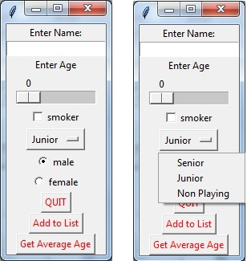

# Graphical User Interface for Recording Member of a Tennisclub

This lab exercise has the following objectives:
- To expand on the TKinter GUI techniques using:
    - Sliders
    - Checkboxes
    - Dropdowns
    - Radio Buttons
- To build on the experience of using Classes to Instantiate and use Objects
- To add objects to a dictionary array
- To loop through a dictionary array of objects, and use an accumulator variable to get a sum/average

# Part 1

Modify the Program called TennisGUI so that rather than having Entry widgets it uses a slider for the persons age, a checkbox to indicate if they are a smoker a dropdown to see what level of member they are, and a radio button to indicate their gender. The GUI should appear as follows:

# Part 2

Modify the self.addToList() function so that when the Button is pressed a new member object is instantiated and appended to the dictionary array self.memberList

# Part 3

Modify the self.getAverageAge() function so that when the Button is pressed a loop will go through each of the objects in the array, get the members age and add it to an accumulator variable. After the loop has completed the average age should be calculated by dividing the total of all the ages by the number of elements in the array. This value should be printed to the screen. The pseudo-code for this function is as follows

loop through each element in self.memberList
     totalOfallAges = totalOfAllAges + thisMembers Age(need to call getter on object)
print totalOfAllAges/numberOfElementsInArray

